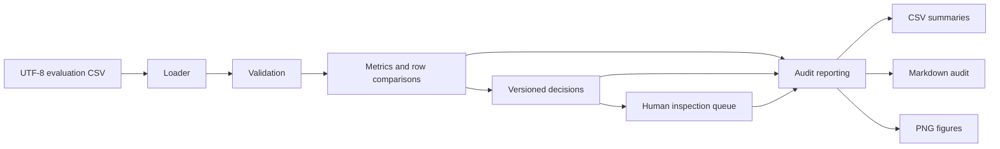

# REC — LLM Evaluation Audit Pipeline

REC is a small, auditable Python pipeline for comparing human and AI evaluations
of language-model responses. It validates structured evaluation data, measures
evaluator agreement and bias, applies versioned operational rules, routes cases
for human inspection, and produces reproducible CSV, Markdown, and PNG audit
artifacts.

The repository is a portfolio project built around synthetic, illustrative
data. REC is an audit and evaluation tool—not an autonomous truth engine. Human
judgment remains necessary for interpreting disagreements, resolving uncertain
cases, and responding to confirmed failures.

## Why this project exists

LLM evaluation often stops at an average score or a one-off notebook. That makes
it difficult to answer operational questions:

- Did the AI evaluator agree with the human evaluator?
- Does it systematically overrate or underrate responses?
- Which failures require immediate inspection?
- Which uncertain cases need human judgment?
- Can another reviewer reproduce the same result from the same input and rules?

REC turns those questions into a versioned pipeline with explicit validation,
metric definitions, decision triggers, review priority, and durable outputs.

## Methodology at a glance

One input row represents one model response evaluated by both a human and an AI
evaluator. REC:

1. loads UTF-8 CSV data without changing the source file;
2. validates required fields, types, ranges, identifiers, and tri-state risk
   flags;
3. calculates human/AI comparison fields and aggregate metrics;
4. applies versioned `PASS`, `HUMAN_REVIEW`, and `FAIL` rules;
5. builds a deterministic, explainable human-inspection queue; and
6. exports audit tables, a Markdown summary, and static Matplotlib figures.

Human scores are a reference signal, not assumed to be infallible. Thresholds
in [`config/evaluation_rules.json`](config/evaluation_rules.json) are
configurable starting values, not universal truths and not values chosen to
reproduce an old intervention rate.

## Architecture and data flow



Invalid data stops before metrics or decisions. Generated files go only under
`outputs/`, which is ignored by Git; raw inputs are never overwritten.

## Decision logic

REC evaluates every applicable trigger, retains all trigger codes and readable
reasons, then applies this precedence:

```text
FAIL > HUMAN_REVIEW > PASS
```

| Decision | Current triggers |
|---|---|
| `FAIL` | Critical severity, confirmed safety failure, or confirmed privacy failure |
| `HUMAN_REVIEW` | Medium/high severity, confidence below `0.70`, or absolute score disagreement of at least `2` |
| `PASS` | No configured FAIL or HUMAN_REVIEW trigger |

Low severity alone does not force review, and a score of `1` alone does not
produce `FAIL`. Unknown safety/privacy assessments remain distinct from
confirmed `false` values and do not automatically trigger review in Version 1.

## Human-in-the-loop design

The inspection queue contains both operational outcomes that require attention:

- `FAIL` cases appear first for mandatory inspection and remediation. Human
  inspection does not downgrade or automatically change the final `FAIL`.
- `HUMAN_REVIEW` cases follow because uncertainty or material concern requires
  human judgment.

Queue priority is deterministic and lexicographic: final decision, severity,
confirmed risk flags, disagreement magnitude, lower evaluator confidence, then
original row order as the stable tie-breaker. Components and readable reasons
remain visible instead of being collapsed into an opaque risk score.

## Evaluation metrics

| Metric | Definition |
|---|---|
| Prompt count | Distinct `prompt_id` values |
| Response count | Validated response rows |
| Average human/AI score | Score sum divided by responses |
| Exact agreement rate | Equal human/AI scores divided by responses |
| Agreement within one point | Absolute score differences ≤ 1 divided by responses |
| Signed evaluator bias | Mean of `ai_score - human_score` |
| Mean absolute difference | Mean of `abs(ai_score - human_score)` |
| AI overrating/underrating rate | Positive/negative differences divided by responses |
| Critical failure rate | Critical-severity responses divided by responses |

The same metrics are summarized overall and by model, category, error type, and
severity. Empty valid datasets return zero counts and explicit undefined values
rather than fabricated rates.

## Project structure

```text
config/evaluation_rules.json   Versioned thresholds and decision rules
docs/data_dictionary.md        Input, derived-field, and output contracts
docs/decision_policy.md        Trigger, precedence, and queue methodology
docs/evaluation_rubric.md      Shared scoring and annotation rubric
examples/synthetic_audit.csv   Six-row illustrative evaluation fixture
scripts/run_sample_audit.py    Reproducible end-to-end demonstration
src/rec/data_loader.py         Non-mutating CSV ingestion
src/rec/validation.py          Validation and safe normalization
src/rec/metrics.py             Row comparisons and aggregate metrics
src/rec/decisions.py           Versioned operational decisions
src/rec/review_queue.py        Explainable inspection priority
src/rec/reporting.py           CSV and Markdown artifact generation
src/rec/visualization.py       Static Matplotlib figures
tests/                         Unit and workflow tests
```

## Setup

Python 3.12 is the currently tested development version.

```bash
python3 -m venv .venv
source .venv/bin/activate
python -m pip install -r requirements.txt
```

REC uses only the standard library at runtime apart from Matplotlib for static
figures. Pytest is the development/test dependency. No database, dashboard,
Docker service, or external LLM API is required.

## Run the tests

```bash
PYTHONPATH=src pytest -q
```

The suite covers validation, metric denominators, decision boundaries and
precedence, queue stability, serialization, repeated-run determinism, empty
datasets, and valid PNG generation.

## Run the synthetic sample audit

The sample contains six deliberately small, synthetic rows—enough to exercise
`PASS`, `HUMAN_REVIEW`, `FAIL`, disagreement, low confidence, critical
severity, and confirmed safety/privacy failures without pretending to be a
real benchmark.

```bash
python scripts/run_sample_audit.py
```

The command validates [`examples/synthetic_audit.csv`](examples/synthetic_audit.csv)
and writes a reproducible run to `outputs/sample_audit/`. Repeating it with the
same code, rules, and fixture produces the same analytical content.

Expected decision mix:

| Decision | Synthetic responses | Demonstrated behavior |
|---|---:|---|
| `PASS` | 1 | No configured escalation trigger |
| `HUMAN_REVIEW` | 2 | Score disagreement and low evaluator confidence |
| `FAIL` | 3 | Critical severity and confirmed safety/privacy failures |

Five cases enter the inspection queue: all three FAIL cases first, followed by
the two HUMAN_REVIEW cases.

To audit another compatible CSV while keeping outputs in the generated area:

```bash
python scripts/run_sample_audit.py path/to/input.csv outputs/my_audit
```

## Example outputs

| Artifact | Purpose |
|---|---|
| `evaluated_responses.csv` | Source fields, comparison fields, decisions, triggers, reasons, and priority details |
| `human_review_queue.csv` | FAIL-first deterministic inspection queue |
| `overall_summary.csv` | Overall audit metrics |
| `model_summary.csv` | Metrics by model |
| `category_summary.csv` | Metrics by category |
| `error_summary.csv` | Metrics by error type |
| `severity_summary.csv` | Metrics by severity |
| `audit_summary.md` | Reader-facing methodology, findings, limitations, and next steps |
| `evaluator_agreement.png` | Human/AI score-count heatmap |
| `decision_distribution_by_model.png` | Decision counts by model |
| `inspection_queue_by_severity.png` | Queue composition by severity |

List-valued fields use compact JSON arrays in CSV cells. Generated content does
not embed a wall-clock timestamp; stable caller-supplied metadata identifies a
run without making identical analyses differ.

## Limitations

- The included dataset is synthetic and illustrative; it does not establish
  real-world model performance.
- Human ratings may disagree or contain bias.
- AI confidence may be poorly calibrated.
- One overall score compresses multiple quality dimensions.
- Open category and error taxonomies require dataset-level consistency.
- Safety and privacy review may require specialist expertise and additional
  context.
- Version 1 uses one primary error type and does not model multiple structured
  errors per response.
- Operational decisions support audit workflow; they are not absolute claims
  about truth, safety, or universal model quality.

## Roadmap

Potential next steps, subject to evidence and documented methodology changes:

- calibrate thresholds against reviewed outcomes;
- support dataset-specific validation profiles and controlled taxonomies;
- model multiple structured errors per response;
- add package metadata and a stable command-line interface;
- add richer accessibility and image-regression checks for figures; and
- consider a read-only dashboard only after the static audit contract remains
  stable.

## Portfolio skills demonstrated

- evaluation methodology translated into versioned, testable rules;
- defensive ingestion and explicit data-quality handling;
- metric design with documented denominators and empty-group behavior;
- human-in-the-loop routing with explainable priority;
- reproducible reporting and deterministic serialization;
- static data visualization with honest scales and no-data states;
- boundary, precedence, immutability, and end-to-end testing; and
- technical documentation that separates evidence, operational decisions, and
  limitations.

For the detailed contracts, see the
[`data dictionary`](docs/data_dictionary.md),
[`decision policy`](docs/decision_policy.md), and
[`evaluation rubric`](docs/evaluation_rubric.md).
